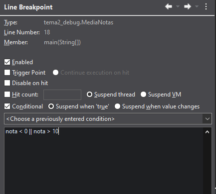

# 🐞 Práctica: Depuración de código en Eclipse

## Objetivo

* Usar el **depurador** de Eclipse (breakpoints, Resume, Step Over/Into/Return).
* Observar **variables** y **flujo** de ejecución.
* **Encontrar y describir** errores (compilación, ejecución o lógica) y corregirlos.
* Entregar evidencias (capturas) + código corregido.

# 📋 Tareas

## 1. Descripción de errores

Los errores detectados han sido:
- **ERROR 1**: La variable `nota` devuelve un error si el tipo de dato es incorrecto.
- **ERROR 2**: Al introducir un valor inválido el programa continúa con el siguiente alumno, en lugar de volver a preguntar por el mismo.
- **ERROR 3**: Si se introduce un valor no numérico para `nota` o `numAlumnos` se produce un error.
- **ERROR 4**: Al introducir un valor fuera del rango de `nota`, el programa lo suma igualmente.
- **ERROR 5**: No hay control sobre el valor introducido en `numAlumnos`.
- **ERROR 6**: La media no se calcula de forma correcta.

## 2. Detección de errores

Los errores fueron detectados de la siguiente manera:
- **ERROR 1**: Se detectó el error al introducir un valor  de `nota` inválido.
- **ERROR 2**:  Se detectó el error al introducir un valor  de `nota` inválido.
- **ERROR 3**: Se detectó el error al introducir un valor  de `nota` y de `numAlumnos` inválido.
- **ERROR 4**: Se detectó el error al introducir un valor  de `nota` fuera de rango.
- **ERROR 5**: Se detectó por la ausencia del `if` correspondiente.
- **ERROR 6**: Se detectó porque el programa devuelve valores incorrectos si se añaden notas fuera del rango.
  
## 3. Cambios en el código
Modificamos las siguientes partes del codigo:
- **ERROR 1**:
- **ERROR 2**:
- **ERROR 3**:
- **ERROR 4**: 
- **ERROR 5**:
- **ERROR 6**:

## 4. Breakpoint condicional

Configuramos un breakpoint condicional para que detenga el código si se introduce un valor fuera del rango (0-10).

## 5. Añadido de expresiones

## 6. Añadido de plantilla

