# 🖥️ Resolución de práctica: Demanda laboral de lenguajes de programación  

## 🎯 Objetivo:  
  
Analizar la demanda laboral de distintos lenguajes de programación en el mercado internacional y en España, utilizando la plataforma LinkedIn.

# 📋​Procedimiento
## 👤 Creación de cuenta  
  Creamos la cuenta de LinkedIn con el correo corporativo @g.educaand.es.
  
  

  Configuramos la visibilidad de la cuenta como perfil privado.
  
  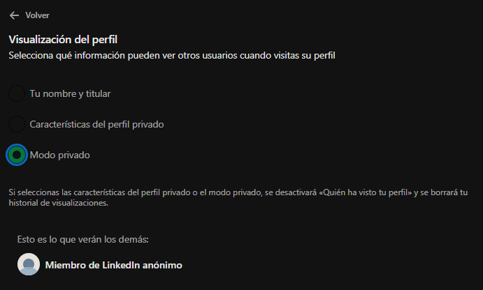

  Desactivamos la opción de búsqueda de empleo.
  
  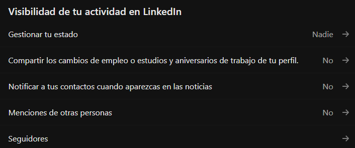
  
## 🌍 Análisis global
  
  Para llevar a cabo el análisis hemos aplicado los siguientes filtros:  
*Sin experiencia  
*En todo el mundo  
  
  ---
  Búsqueda de ofertas en todo el mundo para Java

  
  
  Búsqueda de ofertas en todo el mundo para Python

  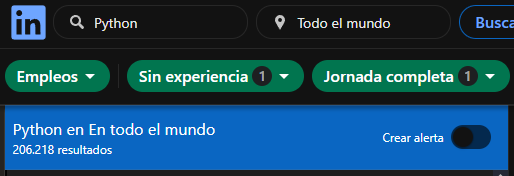
  
  Búsqueda de ofertas en todo el mundo para C#

  
  
  Búsqueda de ofertas en todo el mundo para C y C++

  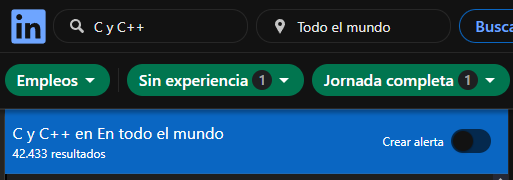
  
  Búsqueda de ofertas en todo el mundo para JavaScript

  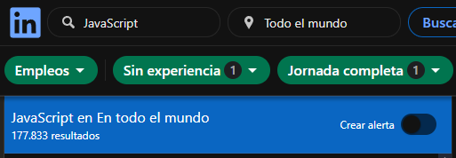
  
  Búsqueda de ofertas en todo el mundo para PHP

  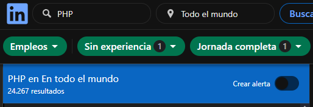
  
  Búsqueda de ofertas en todo el mundo para VB .NET

  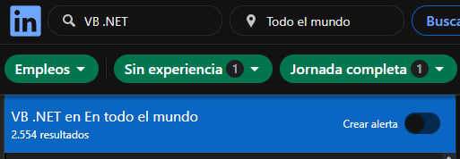
  
  Búsqueda de ofertas en todo el mundo para Ruby

  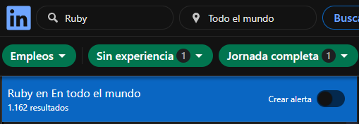
  
## 🧠 Conclusión 

  Texto conclusión 

|Lenguaje|N° ofertas|Puesto ranking global|
|--------|----------|---------------------|
|Java| | |
|Python| | |
|C#| | |
|C y C++| | |
|JavaScript| | |
|PHP| | |
|VB .NET| | |
|Ruby| | |

## 🇪🇸 Análisis nacional

  
  Para llevar a cabo el análisis hemos aplicado los siguientes filtros:

  Búsqueda de ofertas en España para Java

  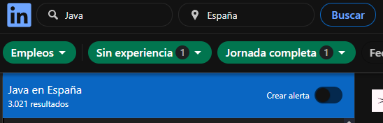
  
  Búsqueda de ofertas en España para Python

  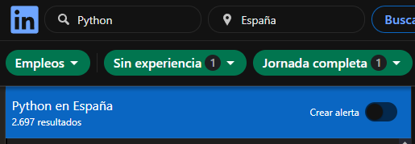
  
  Búsqueda de ofertas en España para C#

  
  
  Búsqueda de ofertas en España para C y C++

  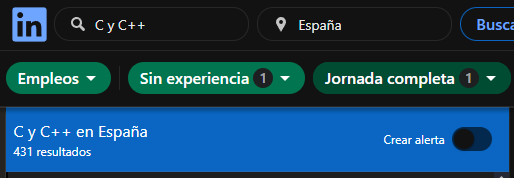
  
  Búsqueda de ofertas en España para JavaScript

  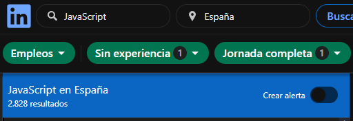
  
  Búsqueda de ofertas en España para PHP

  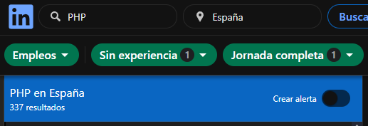
  
  Búsqueda de ofertas en España para VB .NET

  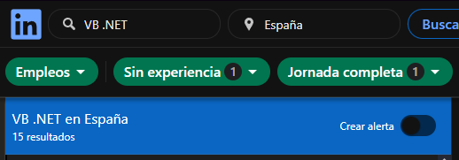
  
  Búsqueda de ofertas en España para Ruby

  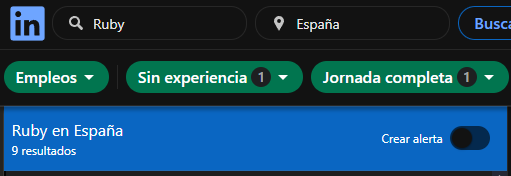
  
## 🧠 Conclusión

  Texto conclusión 

|Lenguaje|N° ofertas|Puesto ranking nacional|
|--------|----------|---------------------|
|Java| | |
|Python| | |
|C#| | |
|C y C++| | |
|JavaScript| | |
|PHP| | |
|VB .NET| | |
|Ruby| | |
