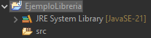

## 🧾 Práctica: **Añadir y usar una librería externa en Eclipse**

### 🎯 Objetivo

Aprender a incorporar una **librería externa (`.jar`)** al *Build Path* de un proyecto Java en Eclipse, y utilizar clases contenidas en esa librería desde nuestro código.

---

### **1. Crear el proyecto**

