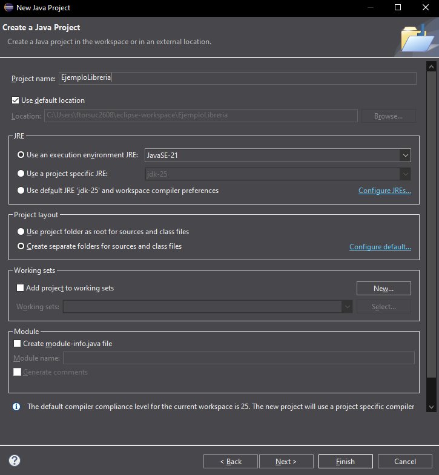

# 🧾 Práctica: **Añadir y usar una librería externa en Eclipse**

## 🎯 Objetivo

Aprender a incorporar una **librería externa (`.jar`)** al *Build Path* de un proyecto Java en Eclipse, y utilizar clases contenidas en esa librería desde nuestro código.

---

## Realización de la práctica

### **1. Crear el proyecto**

Lo primero que debemos hacer es crear un nuevo proyecto java.

Podemos ver que el proyecto se ha creado correctamente, con la librería por defecto y la carpeta src.

Creamos una carpeta nueva con el nombre `lib` en la que guardaremos los paquetes.

Descargamos de internet el `.jar` que vamos a importar a nuestro proyecto.

Al introducir el paquete en la carpeta `lib` necesitamos refrescar el explorador del IDE. Ahora el paquete aparecerá en el panel del explorador.

Para añador la librería al Build Path, haremos clic derecho sobre el proyecto y seguiremos la ruta `Build path > Configure Build Path`

En la pestaña `Libraries` seleccionamos 

# Reflexión final

## ¿Qué pasaría si exporto el proyecto a un .zip y se lo paso a un amigo o me lo llevo al ordenador de casa? ¿Funcionaría? Razona la respuesta.

  Funcionaría, siempre y cuando el JDK sea compatible con la versión utilizada (la misma versión o una superior).
  
## ¿Qué pasaría si eliminas el archivo `.jar` de la carpeta `lib`? *(puedes moverla a otro directorio para probarlo)* ¿Qué ha pasado y por qué?

  Java ya no es capaz de encontrar el '.jar' porque el build path apuntaba a la ruta del paquete, al moverlo ya no es capaz de encontrarlo, a menos que modifiquemos la ruta.

## Y si agrego la librería con `Add External JARs...`. ¿Observas alguna diferencia en la configuración del Build Path? ¿Crees que si lo exporto a .zip y se lo paso a un compañero le funcionaría?

  Al agregar la librería con 'Add External JARs...' no se aprecian diferencias, pero si se lo paso a un compañero no funcionará, porque el paquete no se copiará junto con el proyecto.

## ¿Por qué no es recomendable usar `Add External JARs…` en proyectos que vas a compartir?

  Porque el paquete no se copiará con el proyecto y habrá que añadirlo de nuevo de forma manual.
