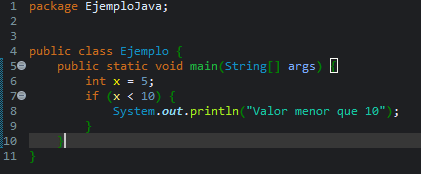
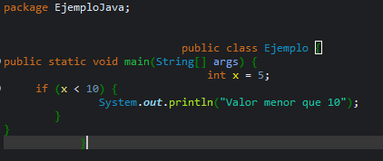
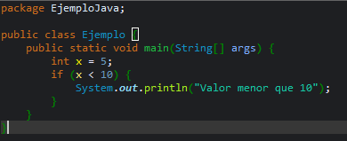
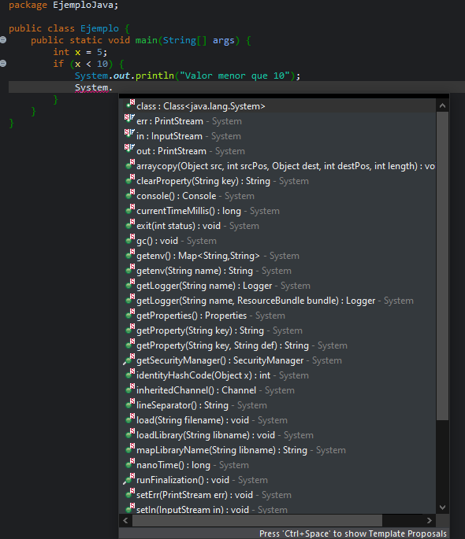
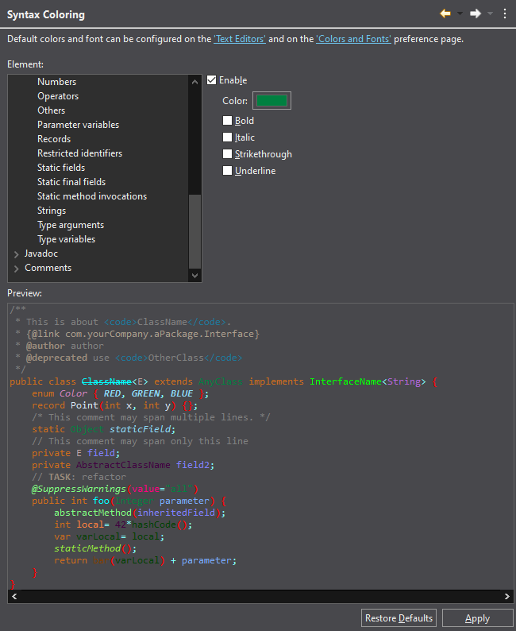
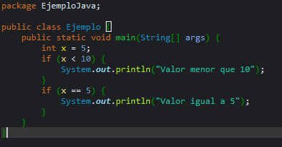
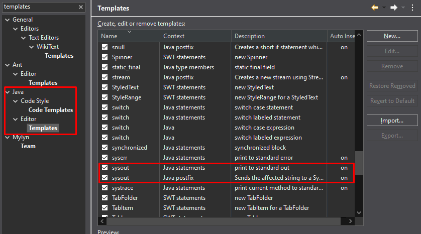

# Práctica: Configuración del Editor de Eclipse

## 🎯 Objetivo
Familiarizarse con las principales **preferencias del editor Java** en Eclipse: personalización visual, ayudas de escritura, acciones automáticas, plantillas y estilo del código.

El alumno deberá **modificar, comprobar y documentar** diferentes opciones del editor, añadiendo **capturas de pantalla** y una breve explicación de su efecto.

## 🧾 Resolución

### **1. Opciones generales**
  
La función `Matching Bracket` ayuda al desarrollador a ver claramente las aperturas y los cierres, lo que le ayuda a evitar errores.

### **2. Save Actions**

La función `Format source code` ajusta automáticamente la indentación, espaciado, saltos de línea y estilo del código para que cumpla con las reglas de formato definidas.
  
La función `Organize imports` gestiona automáticamente las sentencias import al inicio del archivo, para mantener solo las necesarias y ordenarlas de forma coherente.
  

  

### **3. Content Assist**

La función `Auto activation delay (ms)` ayuda al programador mientras escribe código, ofreciendo sugerencias automáticas basadas en el contexto actual.
  

### **4. Syntax Coloring**

La función `Syntax Clouring` sirve para resaltar con diferentes colores las distintas partes del código fuente, según su función o tipo dentro del lenguaje de programación.
Tener un buen contraste visual en el código es muy importante porque mejora la legibilidad, concentración y comodidad visual del programador.
  

### **5. Mark Occurrences**

La función `Mark Occurrences` sirve para ver rápidamente dónde se usa un elemento dentro del mismo archivo.
La función `Search References` sirve para buscar exhaustivamente todas las referencias en todo el proyecto o workspace.

### **6. Typing**

La función `Typing` facilita la escritura del código al completarlo y formatearlo automáticamente, lo que aumenta la velocidad y precisión del programador.

### **7. Templates**

Las plantillas son fragmentos de código predefinidos que puedes insertar rápidamente mediante una palabra clave y la función `Content Assist`.
Podemos modificar o añadir plantillas en `Window → Preferences → Java → Editor → Templates`

# 🧠 **Reflexión**

